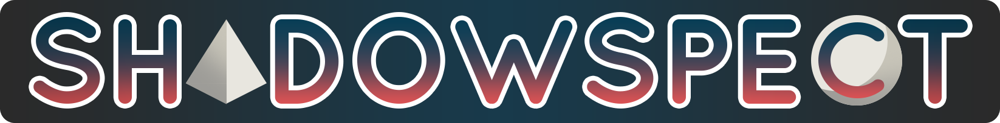

# LAKHackaton 2019 - Challenge on Learning Analytics for Assessment in Games for Learning

     

In this challenge we will work to develop algorithms and analytics for assessment in the context of games for learning.

## Shadowspect

[Shadowspect](http://playful.mit.edu/shadowspect/), addresses the topic area of geometric measurement and dimension, including the relationship between 2D and 3D shapes. As they work through a sequence of puzzles, students will be able to demonstrate their conceptual understanding of geometry and their spatial reasoning skills by imagining and building shapes to solve modeling problems. The game tasks are open-ended enough that players can solve problems in multiple ways, but constrained enough to yield interactions and choices that can feed assessment models. In addition, in the game's sandbox mode players will be able to use their imaginations to freely explore the properties of 3D shapes and build elaborate constructions, which will enable us to assess elements of their creativity and creative process as well. This project is being developed by [MIT Playful Journey Lab](http://playful.mit.edu/) in collaboration with [MIT Education Arcade](https://education.mit.edu/).

You can [play the game here](http://gbakimchi.herokuapp.com/feb-review/).

## Case Studies

This game has been developed following a rapid prototyping strategy with multiple playtesting during the process. We have conducted three playtests (around 40 participants total) after having the final version of the game, which are the ones that we will use for data analysis.

- **TSL Dine and Play**: The MIT Teaching Systems Lab invites teachers, student teachers, and education professionals to playtest our new interactive tools for teachers. At Dine and Play, you will try out our games and share your feedback over dinner. These are short sessions of 45 minutes interacting with the game, and no particular instructions except for a very brief overview are provided at the beginning of the session.
- **High school students**: A group of 17 students from a private high school came to the Ed Arcade lab to learn about game design at MIT and as part of this visit they played Shadowspect for about an hour. They were not given any instructions at the start, simply directed to play through the tutorial levels and then try more puzzles. Near the end of the session, they were also encouraged to try the sandbox mode to experience all features of Shadowspect.

## Data

We will be looking at the following two data sources (we will provide the data as a separate link):

- **Clickstream data**: Shadowspect collects all clickstream data within the game, [here is the codebook](https://docs.google.com/document/d/1dC7yZu4QAsBIUSdB5_smARTF3ywjBYKSe6zFGW_a24s/edit?usp=sharing) of this dataset.
- **Configuration files**: Contain details of the configuration of the game and puzzles for each case study.

We provide an [initial script](LAK_Hackaton.ipynb) with basic feature engineering.

## Orinial proposed challenges

1. Game analytics 
	- Level difficulty (efficiency in number of attempts to solve, number of required actions, time per level)
	- Sequence of levels to get stuck (learning pathways)
	- Tutorial analytics, initial learning curve
	- Funnel: Opening puzzle - Setting up an object - Trying submit - Completing puzzle (user level and puzzle)
	- User interface confusion

2. Cognitive skills and behavioral assessment:
	- Persistence within puzzle and between puzzles
	- Wheel spinning and unreflective behaviors
	- Detecting confussion for adapted feedback
	- Strategies (abstract thinking vs reactive strategies)
	- Off-task (random actions with shapes, clicks, coloring...)
	- Gaming the system
	- Creativity, did you come up with a solution that the designer did not think about or how different is your solution from others
	- Spatial reasoning

3. Content assessment: We are planning to leave this out of the challenge as we are building this based on Evidence-Centered Design but just in case...
	- CCSS.MATH.CONTENT.HSG.MG.A.1: Use geometric shapes, their measures, and their properties to describe objects (e.g., modeling a tree trunk or a human torso as a cylinder
	- CCSS.MATH.CONTENT.HSG.CO.A.3: Given a rectangle, parallelogram, trapezoid, or regular polygon, describe the rotations and reflections that carry it onto itself
	- CCSS.MATH.CONTENT.HSG.GMD.B.4: Identify the shapes of 2D cross-sections of 3D objects, and identify 3D objects generated by rotations of 2D objects
	- CCSS.MATH.CONTENT.HSG.CO.D.12: Make formal geometric constructions with a variety of tools and methods (compass and straightedge, string, reflective devices, paper folding, dynamic geometric software, etc.)
	- Ratio: Puzzle requires players to gauge the length/height/width of silhouettes to estimate how big objects need to be scaled, how many objects they need, or how far apart objects have to be

	
## Results after *hacking* the challenge

Josh Ring, Matthew Jone, Daniel Spikol, Gábor Kismihók and José A. Ruipérez Valiente participated in this challenge. We have grouped to work in several areas. 

### Josh Ring: Spatial closeness to solution

Josh has worked in trying to detect the spatial closeness of the current set of shapes of the student to the final solution by geometrically comparing the current shape setup and the one in the solution. His code is in [this script](WIP_code.py).

### Gábor Kismihók and Daniel Spikol: Feedback for students

Gábor and Daniel have been working in how to provide feedback to students when they are stuck in the process of solving a puzzle. Here are their [final thoughts](Shadowspect Hints and Score.pdf).

### José A. Ruipérez Valiente: Measuring puzzle difficulty

José has been working on how to measure puzzle difficulty in order to improve the design of puzzles and learning pathways. There are three metrics that has been considered as part of the  difficulty: time invested in puzzle, number of actions and percentage of incorect, all of them following the trend that the higher the metric is, the most difficult. We have also designed a composite measure based on these three variables by standarizing each variable separately, summing the three of them and normalizing from 0 to 1. Therefore, 0 would be the easiest puzzle and 1 the hardest in terms of the three measures. The code for this is in [this script](puzzle_difficulty.ipynb). We plot these metrics by puzzle using the puzzle order in the game in [this plot](DifficultyByPuzzle.png) with this [R script](plot_difficulty.R).

### Matthew Jone: Attempts vs succcess

Matthew's goal from this project in the LAKAthon was looking at the number of success verses attempts in each project. I wanted to see which shapes were used by everyone that was making an attempt verses the ones that failed. Some interesting things I found (code in [this script](DMatt_Hackathon.ipynb)): 

- Some of the solutions used shapes that weren’t in the actual solution, so there were many people completing the puzzle using alternate solutions.

- Even though many of the puzzles had a low success rate and few puzzles were completed , the total actions taken by those who had a success was more than 60% of the total actions. So it seems like many students gave up.

- Some of this could be used to help to inform problem difficulty, a system to provide hints to the user based on all possible solutions. It could also be applied to more factors than just shapes.